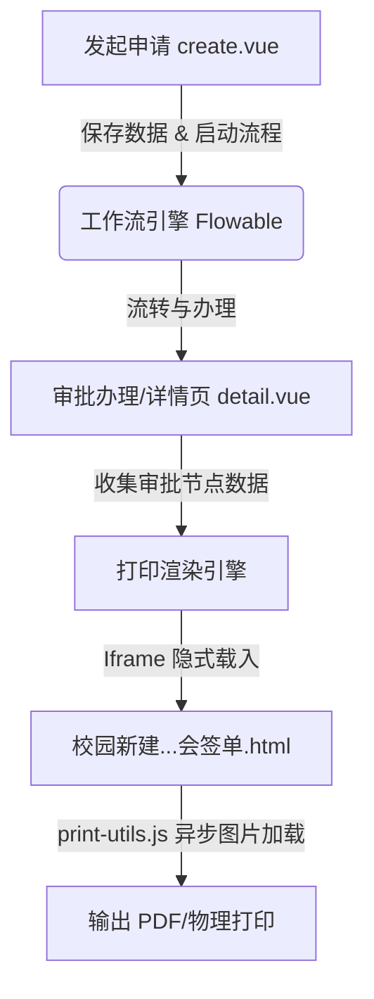

# 校园新建/改建/扩建项目联合审批业务分析与提交报告

本项目实现了**“校园新建/改建/扩建施工项目联合审批”**业务全流程。该业务旨在规范校园基础设施建设的立项、联合会签及最终审批流程。本报告对该业务的代码实现、技术架构及本次优化内容进行深度分析，并整理为规范的 Git 提交报告。

---

## 一、 业务与核心功能分析

### 1. 业务流转背景
校园新建改扩建项目涉及学校多个职能部门的协同。项目通常由**牵头部门**发起，经过**使用部门**（可能有多个）、**安全管理部门**会签，最终由**分管校领导**、**校长**及**董事长**逐级审批。

### 2. 核心技术栈
*   **前端**：Vue 3 + Vite + TypeScript + Element Plus
*   **后端**：Java (Spring Boot) + Flowable (工作流引擎) + MyBatis-Plus (持久层)
*   **打印输出**：基于原生 HTML/CSS (`@media print`) + Iframe 异步打印技术，实现高度还原的“公文级”打印排版。

---

## 二、 代码实现与架构分析

项目代码围绕**数据录入、流程协同、附件归档、公文打印**四大板块展开：



### 1. 页面功能模块
*   `create.vue` (申请发起页)
    *   动态获取当前登录用户的部门作为默认项目“牵头部门”。
    *   提供项目基本信息（地点、负责人、建设周期、投资额、项目用途及概况）录入。
    *   以“多选树”形式支持选择多个“使用部门”。
    *   采用勾选分类上传的方式管理附件，支持“施工单位资质证明”、“初步设计方案及概算”、“施工图设计文件”及自定义的“其他”附件。
*   `detail.vue` (流程详情/审批页)
    *   作为工作流的审批表单容器，兼容“只读查看模式”与“退回重做模式”。
    *   根据 Flowable 返回的 `processInstanceId` 加载审批历程，并通过 `ApprovalComments` 组件直观呈现各级审批意见。
*   `校园新建改扩建项目联合审批会签单.html` (专属打印模版)
    *   纯原生 HTML/CSS + B/S 架构打印模版。
    *   内嵌 `window.initData` 接收审批数据，配合 `print-utils.js` 进行签字图片预加载，实现一键调起浏览器打印。

### 2. 数据库与后端关联
*   `CampusConstructionApprovalService.java` 处理主表单的 CRUD，并协调工作流。
*   `CampusConstructionApprovalUseDeptDO.java` 存储使用部门的关联关系（支持一对多，多部门联合会签）。

---

## 三、 本次优化内容

针对打印表单美观度、页面一致性及交互体验，进行了如下深度重构：

### 1. 会签打印排版重构
*   **移除职责提示**：删除了打印模版中冗余的“审核项目基本信息...”等说明，使公文打印只留存审批事实。
*   **合并使用部门列（Rowspan）**：在有多个使用部门会签时，第一列“使用部门”自动合并单元格（居中对齐）；“会签意见”与“签字/日期”列独立分行，并自动补充对应部门前缀（如 `**教务处**：同意`），从而使得多人会签排版规整，达到官方公文标准。
*   **签字安全兼容**：若审批人缺失电子签名，则自动渲染绝对定位的“日期：”与横线，供线下人工补签。

### 2. 附件清单智能过滤
*   在 `detail.vue` 详情展示中，重构了附件的只读展示逻辑。若某类附件（共 4 类）未上传，则完全隐去该分类标题与“无”字提示；若四类附件均无数据，则统一显示为一个“无”，大幅缩减不必要的空白占用，排版更加精致。

### 3. 创建与详情页视觉一致性（Color Theme）
*   由于创建页（`create.vue`）原先采用了灰蓝色调的后台默认样式，与详情页（`detail.vue`）的纸张质感表单不匹配。
*   **重构样式**：将创建页的包裹底色调整为温暖舒缓的纸张原色（`#eae7de`），并同步更新了 `.paper-wrap` 的 1.5px 浅灰边框、重叠阴影；将 `.info-table` 的内网格边框调细为 `#999`，并统一了 `.label-cell` 的暖杏底色（`#f5f4ee`）与字间距，实现视觉体验的无缝统一。

---

## 四、 Git 提交报告规范

以下是将上述改动整理成的标准 Git Commit 日志规范：

```markdown
# ------------------------------------------------------------------------------
# Commit 1: 打印模版会签行合并及排版美化
# ------------------------------------------------------------------------------
feat(print): 优化校园新建联合审批打印会签单格式与职责文案去除

- 移除打印件中项目牵头部门、使用部门、安全部门的内置职责描述文案，保持版面整洁
- 重构使用部门动态渲染逻辑：
  * 支持多使用部门合并第一列（rowspan 合并）
  * 意见与签名列分行独立展示，并自动带入部门名称前缀标识
  * 无数据时提供占位横线，兼容电子签名与线下手动签字
- 优化打印分页控制，增加 tr { page-break-inside: avoid; } 避免跨页断行

# ------------------------------------------------------------------------------
# Commit 2: 详情页附件展示与温馨提示优化
# ------------------------------------------------------------------------------
style(detail): 重构附件清单只读展示并新增会签备注提示

- 重构 `detail.vue` 附件渲染方式：
  * 采用 `v-if` + 动态过滤，对未上传文件的附件类型隐藏其分类标题，避免冗余展示
  * 当所有附件类型均无文件时，统一展示单行“无”提示
- 在附件清单下方新增“备注”引导行，加粗红色展示会签意见的规范性要求：
  * 明确要求写明“同意”、“不同意”或“需修改后重新审核”及具体理由

# ------------------------------------------------------------------------------
# Commit 3: 创建页与详情页视觉风格对齐
# ------------------------------------------------------------------------------
style(create): 调整创建会签单页面的配色与排版风格，实现与详情页高度一致

- 将 `create.vue` 表单背景色由灰蓝色 `#f0f2f5` 改为纸张色 `#eae7de`
- 调整 `.paper-wrap` 容器，增加 1.5px 浅灰色边框，更新投影参数与内边距
- 对齐 `.info-table` 表格边框至 1.5px `#555`，内部单元格边框对齐至 `#999`
- 统一 `.label-cell` 的背景色为 `#f5f4ee`、文字颜色为 `#555`，并调整文字字号与字间距
```
